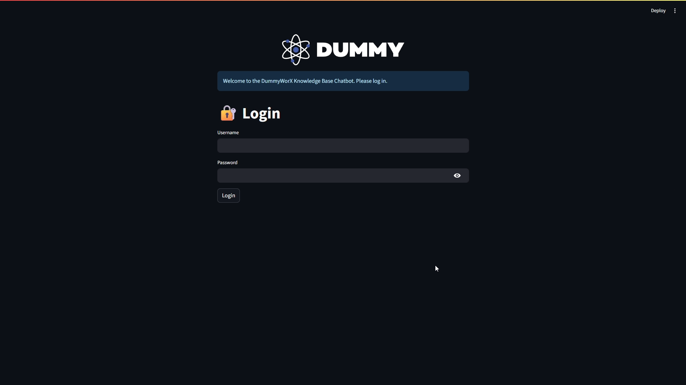

# Employee AI Onboarding Assistant


A secure, multi-departmental RAG (Retrieval-Augmented Generation) chatbot designed to solve critical onboarding and knowledge management challenges in a corporate environment. Built with a modern Python stack, this application serves as an intelligent, 24/7 assistant that provides instant, accurate answers from a company's internal knowledge base.

This project demonstrates a production-ready approach to building enterprise-grade AI assistants with features like role-based access, dynamic content management, and configurable AI models.



---

## 🎯 Solving Real-World Business Problems

Onboarding new employees and managing internal knowledge is a persistent challenge for many organizations. This AI assistant is designed to directly address these pain points:

1.  **Reduces Repetitive HR & IT Queries:**
    *   **Problem:** HR, IT, and department managers spend countless hours answering the same basic questions from new hires ("What are the working hours?", "How do I connect to the VPN?", "What's the dress code?").
    *   **Solution:** The chatbot provides instant, accurate answers to these FAQs, freeing up valuable time for senior employees to focus on more strategic tasks.

2.  **Ensures Consistent and Accurate Information:**
    *   **Problem:** Information given to new hires can be inconsistent or outdated. A forgotten policy update in a static PDF can lead to confusion.
    *   **Solution:** The chatbot acts as a **Single Source of Truth**. The admin panel ensures the knowledge base is always up-to-date, and source citations allow users to verify information, building trust and ensuring compliance.

3.  **Accelerates Time-to-Productivity:**
    *   **Problem:** New employees often feel lost, struggling to find the right documents or people to ask. This "information-finding" phase delays their ability to contribute meaningfully.
    *   **Solution:** By providing immediate, context-aware answers tailored to their department, the assistant drastically shortens the learning curve and empowers new hires from day one.

---

## ✨ Key Features

-   **🔐 Secure, Role-Based Access Control (RBAC):** A complete login system with hashed passwords distinguishes between `admin` and departmental `user` roles.
-   **🧠 Multi-Tenant RAG Architecture:** Knowledge base is partitioned by department, with a shared `general` knowledge base automatically loaded for all users. Provides source citations for every answer.
-   **⚙️ Dynamic Admin Panel:** A self-service portal for administrators:
    -   **User Management:** Create, view, and delete user accounts at runtime. Features dynamic, department-aware role selection.
    -   **Document Management:** Full CRUD (Create, Read, Update, Delete) capabilities for all knowledge documents.
    -   **Live Re-indexing:** A one-click "Update Knowledge Base" button clears the old vector store, forcing the AI to re-learn from the latest information.
    -   **Runtime AI Configuration:** Switch the underlying Gemini model (`1.5 Pro` vs. `1.5 Flash`) on the fly to balance performance and cost.
-   **💬 Interactive & User-Friendly UI:** A clean, modern chat interface with personalized welcome messages, timestamped chats, and dynamic, role-aware sample prompts.
-   **🚀 Containerized & Deployable:** Fully containerized with Docker for easy, one-command setup and deployment.

---

## 🏗️ Design & Architectural Choices

This project intentionally uses a file-based approach for data and user management to prioritize simplicity, portability, and rapid development that you can extend later on.

-   **Why `.txt` files for the knowledge base?**
    -   **Simplicity & Speed:** Using plain text files eliminates the need for complex parsing libraries (like for PDFs or DOCX), keeping the application lightweight and focused on the core RAG logic.
    -   **Ease of Management:** Non-technical admins can easily create, edit, or replace knowledge documents in a simple folder structure.

-   **Why `users.yaml` instead of a database?**
    -   **Portability:** A YAML file is self-contained and requires no external database server, making the application incredibly easy to set up and run anywhere with Docker.
    -   **Human-Readability:** YAML is easy for administrators to read and manually edit for quick user management, which is ideal for a small to medium-sized deployment.

---

## 🛠️ Tech Stack

-   **Frontend:** Streamlit
-   **AI Framework:** LangChain
-   **LLM & Embeddings:** Google Gemini (`gemini-2.5-pro`, `gemini-2.5-flash`, `gemini-2.5-flash-lite` )
-   **Vector Store:** FAISS (Facebook AI Similarity Search)
-   **Authentication:** Custom YAML-based authentication with password hashing
-   **Containerization:** Docker & Docker Compose

---

## 🚀 Getting Started

Follow these steps to set up and run the application locally.

### 1. Prerequisites

-   [Docker](https://www.docker.com/products/docker-desktop/) and Docker Compose installed and running.
-   A **Google Gemini API Key**.

### 2. Obtaining a Gemini API Key

This project requires an API key from Google AI Studio to function.

1.  Visit the [Google AI Studio](https://aistudio.google.com/).
2.  Log in with your Google account.
3.  Click on **"Get API key"** > **"Create API key in new project"**.
4.  Copy the generated API key.

### 3. Setup and Configuration

**A. Clone the Repository**
```bash
git clone <your-repository-url>
cd employee-onboarding-rag
```

**B. Create the `.env` File**
This is the **only file you must create manually**. In the project's root directory, create a `.env` file and paste your API key.
```
# .env
GOOGLE_API_KEY="YOUR_GOOGLE_API_KEY_HERE"
```

**C. Review Example Configurations**

This project includes example configuration files to get you started immediately:
-   `config.json`: Sets the default AI model (`gemini-2.5-flash`). This can be changed later in the admin panel.
-   `users.yaml`: Contains a pre-configured list of users, including an `admin` and several departmental users.
    > **For demonstration purposes, the password for all example users in this file is `password`**.

### 4. Build and Run the Application

With Docker running, execute the following command in the project root:
```bash
docker-compose up --build
```

### 5. Logging In

-   The application will now be accessible in your browser at **`http://localhost:8501`**.
-   You can log in using the credentials from the `users.yaml` file. For example:
    -   **Username:** `admin`
    -   **Password:** `password`
---

## 📄 License

This project is licensed under the MIT License. This means you are free to use, copy, modify, merge, publish, distribute, sublicense, and/or sell copies of the software. see the [LICENSE](LICENSE) file for details.